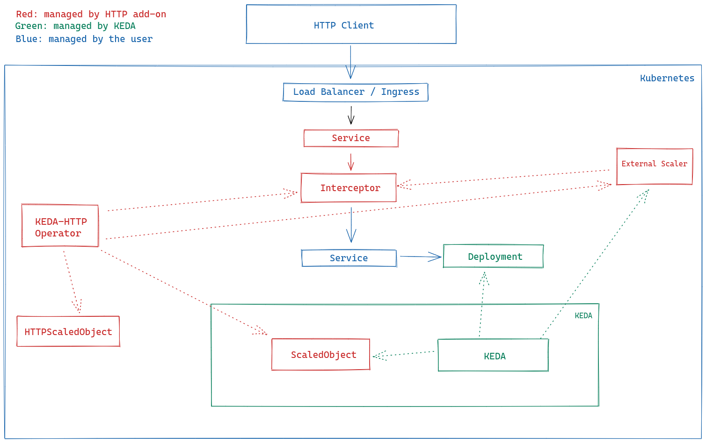

# ASR system

The automatic speech recognition system.

## Getting Started

These instructions will get you a copy of the project up and running on your local machine for development and testing
purposes. See deployment for notes on how to deploy the project on a live system.

### Prerequisites

```
python 3.9
poetry 1.5.1
```

### Installation

* Third party Package installation

```bash
cd code
python -m pip install --upgrade pip
pip install poetry==1.5.1
poetry install
```

## Run application

### Local

* Run API

```bash
uvicorn app.main:app --host 0.0.0.0 --port 80
```

### Docker

* Build an image

```bash
docker build -t whisper .
```

* Run

```bash
docker run --rm -p 80:80 whisper
```

## Kube deployment

This application could be deployed on Kubernetes cluster. We're using the Minikube for local development.
Follow the steps below to deploy the application on Minikube.

Install Minikube

```bash
brew install minikube
```

First, start Minikube using the Docker driver. This will allow Minikube to use your local Docker daemon.

```bash
minikube start --driver=docker
```

To make Minikube use your local Docker images, you need to configure the Docker environment of Minikube.

```bash
eval $(minikube -p minikube docker-env)
```

*Reverting to Host Docker Daemon*: If you want to switch back to using your host’s Docker daemon, simply run:

```bash
eval $(minikube -p minikube docker-env --unset)
```

To verify that you’re using the Minikube Docker daemon, run.

```bash
docker images
```

Build your Docker image locally using Docker.

```bash
docker build -t whisper .
```

Create a namespace called *whisper* where the application will be deployed.

```bash
kubectl create namespace whisper
```

Deploy the application.

```bash
kubectl apply -f kube
```

Run the following to get the local url to access the application:

```bash
minikube service whisper-service --url -n whisper
```

## Horizontal Scaling on Kubernetes

To efficiently handle traffic spikes and increase the availability of your application on Kubernetes, horizontal
scaling (increasing the number of pod replicas) can be implemented. Kubernetes offers different ways to scale an
application based on certain metrics, such as CPU usage, memory usage, or custom metrics like the number of HTTP
requests.

1. **Horizontal Pod Autoscaler (HPA)**: Kubernetes provides a native Horizontal Pod Autoscaler (HPA) that scales the
   number of pod replicas based on CPU or
   memory utilization, or even custom metrics if configured with a Prometheus adapter. HPA works well in many scenarios
   where resource usage can predict the need for scaling. While HPA is simple and effective for resource-based
   autoscaling, it doesn't natively support scaling based on the number of incoming HTTP requests or other event-driven
   metrics. For this reason, I prefer using KEDA for scaling based on HTTP traffic.
2. **[KEDA HTTP adon](https://github.com/kedacore/http-add-on) (Kubernetes Event-Driven Autoscaling)** is a powerful tool that allows Kubernetes applications to scale based
   on
   external event sources and custom metrics. One of the standout features of KEDA is its ability to scale your
   application based on HTTP request count, which is particularly useful for web applications that experience variable
   traffic.

*Why KEDA is a better choice for HTTP-based autoscaling:*

- **Event-Driven Scaling**: KEDA can scale based on HTTP request metrics, external queue lengths (e.g., RabbitMQ,
  Kafka), or
  even cloud services like Azure Service Bus and AWS SQS. This flexibility makes KEDA ideal for autoscaling applications
  that need to respond dynamically to fluctuating user requests.
- **Fine-Grained Control**: Unlike HPA, which relies on resource usage (CPU, memory), KEDA allows you to scale based on
  actual
  application traffic patterns, such as the number of incoming HTTP requests. This leads to better scaling behavior for
  traffic-heavy APIs or web services.
- **Custom Metrics**: KEDA can work with Prometheus or other metrics sources to define custom metrics (e.g., number of
  requests per second, database queue length) to trigger scaling decisions.



  