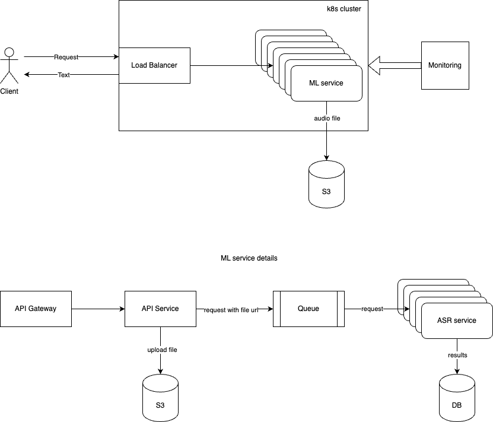

# ASR system

The automatic speech recognition system.
Time spent on the project: **2-3 hours** approx.

## Getting Started

These instructions will get you a copy of the project up and running on your local machine for development and testing
purposes. See deployment for notes on how to deploy the project on a live system.

### Prerequisites

```
python 3.9
poetry 1.5.1
```

### Installation

* Third party Package installation

```bash
cd code
python -m pip install --upgrade pip
pip install poetry==1.5.1
poetry install
```

## Run application

### Local

* Run API

```bash
uvicorn app.main:app --host 0.0.0.0 --port 80
```

### Docker

* Build an image

```bash
docker build -t whisper .
```

* Run

```bash
docker run --rm -p 80:80 whisper
```

## Kube deployment

This application could be deployed on Kubernetes cluster. We're using the Minikube for local development.
Follow the steps below to deploy the application on Minikube.

Install Minikube

```bash
brew install minikube
```

First, start Minikube using the Docker driver. This will allow Minikube to use your local Docker daemon.

```bash
minikube start --driver=docker
```

To make Minikube use your local Docker images, you need to configure the Docker environment of Minikube.

```bash
eval $(minikube -p minikube docker-env)
```

*Reverting to Host Docker Daemon*: If you want to switch back to using your host’s Docker daemon, simply run:

```bash
eval $(minikube -p minikube docker-env --unset)
```

To verify that you’re using the Minikube Docker daemon, run.

```bash
docker images
```

Build your Docker image locally using Docker.

```bash
docker build -t whisper .
```

Create a namespace called *whisper* where the application will be deployed.

```bash
kubectl create namespace whisper
```

Deploy the application.

```bash
kubectl apply -f kube
```

Run the following to get the local url to access the application:

```bash
minikube service whisper-service --url -n whisper
```

## Main challenges to be addressed in the project

The goal of this project was to meet the following requirements:

- The MVP would have to be functional and scalable for 100 sales. It's worth noting that the solution should be scalable
  for all sales (x10 or so), and that we'll probably need advice on how to improve the solution's scaling.
- This MVP will have to be integrated by software engineers for testing, so the API contract will have to be clear (take
  an audio format as input and text as output).

Below are the main challenges that we faced during the project:

- **Model selection and accuracy**: we could expect different audio quality and accents, so the model should be able to
  handle these variations.
- **Real-time or Batch processing**: we had to decide whether the system should process the audio in real-time or in
  batch mode.
- **Scalability**: the system should be able to handle a large number of requests, especially during peak times.
- **API design**: the API should be easy to use and well-documented for integration by software engineers.
- **Data Management**: we had to decide how to store the audio files and transcriptions, and how to manage the data
  efficiently.
- **Monitoring and Logging**: we needed to implement monitoring and logging to track the performance of the system and
  troubleshoot any issues.

## High-level architecture

Here's a high-level overview of the architecture:

1. Client: The sales team or other integrated systems make API requests to upload audio files and retrieve
   transcriptions.
2. Load Balancer: Distributes incoming requests across multiple instances of the API server, ensuring high availability
   and load distribution.
3. API Gateway/Ingress Controller: Manages incoming HTTP(S) requests, handles routing to the appropriate services, and
   can enforce security policies (e.g., authentication, authorization).
4. Microservices on Kubernetes:
    - API Service: Handles requests for audio upload and transcription retrieval.
    - Transcription Service: Processes audio files, either by interacting with an external managed transcription
      service.
5. Message Queue (e.g., RabbitMQ, Kafka): Manages asynchronous task processing by sending audio files for transcription
   to the Transcription Service, enabling horizontal scalability.
6. Storage:
    - Object Storage: Stores the audio files and processed transcription data.
    - Database: Stores metadata and transcription results, allowing for quick lookups and indexing (e.g., PostgreSQL,
      MongoDB).
7. Monitoring and Logging: Monitors system performance and logs errors for observability, alerting, and debugging
   purposes.



### Flow

- Client Request: A client (e.g., a web app) sends a transcription request by uploading an audio file to the API
  Service.
- Message Queue: The API Service stores the audio file in object storage, creates a job message with metadata (file
  location, request ID), and sends it to the queue.
- Transcription Service: A Transcription Service pod picks up the job, retrieves the audio, performs transcription, and
  saves the text result to the database.
- Status Update: The Transcription Service updates the transcription status in the database, allowing clients to
  retrieve
  it through the API.

### Architecture Design for Real-Time Speech-to-Text Using Triton Inference Server

We could also use a ready-made solution like the Triton Inference Server to deploy a real-time speech-to-text model.
In this case we need to replace the Transcription Service with the Triton Inference Server, which would handle the model
inference and transcription tasks.

## Libraries and Tools

In order to build the ASR system, we used the following libraries and tools:

- **FastAPI**: A modern, fast (high-performance) web framework for building APIs with Python 3.7+ based on standard
  Python
  type hints.
- **librosa** or **torchaudio**: For audio processing and feature extraction.
- **boto3**: For interacting with AWS services like S3.
- **ffmpeg**: For audio file conversion.
- **Docker**: For containerizing the application.
- **Kafka** or **RabbitMQ**: For message queuing and asynchronous task processing.
- **PostgreSQL**: For storing metadata and transcription results.
- **Prometheus** and **Grafana**: For monitoring and alerting.
- **Kubernetes**: For container orchestration and scaling.

## Infrastructure as Code (IaC) with Terraform

Building a scalable infrastructure with Terraform for a real-time, high-availability system involves creating a
repeatable, modular, and secure configuration that can be deployed on cloud platforms like AWS, Google Cloud, or Azure.
Here’s an outline of how to set up a scalable infrastructure with Terraform and the deployment process.

For this case, let’s assume we’re deploying the infrastructure on AWS. The infrastructure components will typically
include:

- VPC and Networking: A custom Virtual Private Cloud (VPC) with subnets for different layers (public and private),
  security groups, NAT gateways, and routing.
- Kubernetes Cluster (EKS): An Elastic Kubernetes Service (EKS) cluster for deploying and scaling the application and
  inference services.
- Database: A managed database service like Amazon RDS for storing metadata and results.
- Compute Instances: Node groups for the EKS cluster, potentially with autoscaling for load management.
- Load Balancers: Application Load Balancer (ALB) to manage incoming traffic.
- Storage: S3 buckets for storage and Redis or RDS for caching and persistent storage.
- Secrets Management: AWS Secrets Manager for securely storing API keys, database credentials, etc.
- Monitoring and Logging: CloudWatch for monitoring, and possibly an ELK stack if centralized logging is needed.

## Infrastructure issues to consider

When deploying a real-time ASR system, there are several infrastructure issues to consider:

- **Scalability**: The system should be able to handle a large number of requests, especially during peak times. This
  requires horizontal scaling of the API service, message queue, and transcription service.
- **High Availability**: The system should be designed for high availability to ensure that it remains operational even
  in the event of failures. This can be achieved through redundancy, load balancing, and failover mechanisms.
- **Data Management**: The system should be able to handle large volumes of audio data and transcriptions efficiently.
  This requires a robust storage solution, data partitioning, and indexing for fast retrieval.
- **Security**: The system should be secure to protect sensitive data and prevent unauthorized access. This includes
  encryption, access controls, and secure communication between services.
- **Monitoring and Logging**: The system should be monitored for performance, errors, and security incidents. Logging
  should be in place to track system behavior and troubleshoot issues.
- **Cost Optimization**: The infrastructure should be cost-effective, with provisions for scaling up or down based on
  demand. This requires efficient resource utilization, auto-scaling, and cost monitoring.
- **Disaster Recovery**: The system should have backup and recovery mechanisms in place to ensure data integrity and
  continuity in case of disasters.
- **Performance Optimization**: The system should be optimized for performance, with fast response times and minimal
  latency. This requires efficient data processing, caching, and load balancing.
- **API Design**: The API should be well-designed, with clear documentation, error handling, and versioning to ensure
  ease of use and integration by clients.
- **Deployment Automation**: The infrastructure should be deployed and managed using automation tools like Terraform or
  Ansible to ensure consistency and repeatability.

## Horizontal Scaling on Kubernetes

To efficiently handle traffic spikes and increase the availability of your application on Kubernetes, horizontal
scaling (increasing the number of pod replicas) can be implemented. Kubernetes offers different ways to scale an
application based on certain metrics, such as CPU usage, memory usage, or custom metrics like the number of HTTP
requests.

1. **Horizontal Pod Autoscaler (HPA)**: Kubernetes provides a native Horizontal Pod Autoscaler (HPA) that scales the
   number of pod replicas based on CPU or
   memory utilization, or even custom metrics if configured with a Prometheus adapter. HPA works well in many scenarios
   where resource usage can predict the need for scaling. While HPA is simple and effective for resource-based
   autoscaling, it doesn't natively support scaling based on the number of incoming HTTP requests or other event-driven
   metrics. For this reason, I prefer using KEDA for scaling based on HTTP traffic.
2. **[KEDA HTTP adon](https://github.com/kedacore/http-add-on) (Kubernetes Event-Driven Autoscaling)** is a powerful
   tool that allows Kubernetes applications to scale based
   on
   external event sources and custom metrics. One of the standout features of KEDA is its ability to scale your
   application based on HTTP request count, which is particularly useful for web applications that experience variable
   traffic.

*Why KEDA is a better choice for HTTP-based autoscaling:*

- **Event-Driven Scaling**: KEDA can scale based on HTTP request metrics, external queue lengths (e.g., RabbitMQ,
  Kafka), or
  even cloud services like Azure Service Bus and AWS SQS. This flexibility makes KEDA ideal for autoscaling applications
  that need to respond dynamically to fluctuating user requests.
- **Fine-Grained Control**: Unlike HPA, which relies on resource usage (CPU, memory), KEDA allows you to scale based on
  actual
  application traffic patterns, such as the number of incoming HTTP requests. This leads to better scaling behavior for
  traffic-heavy APIs or web services.
- **Custom Metrics**: KEDA can work with Prometheus or other metrics sources to define custom metrics (e.g., number of
  requests per second, database queue length) to trigger scaling decisions.


